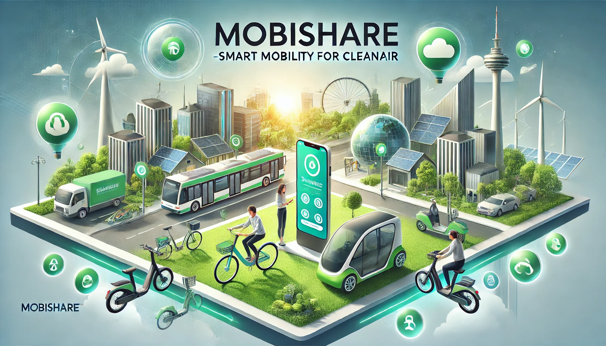

# MobiShare


An application with a microservices architecture for managing a short-term vehicle rental system. Developed with my university friends Matteo Barbieri and Davide Godino.

## Contents

- [Report](#report)
- [Architecture](#architecture)
- [OpenAPI Documentation](#openapi-documentation)
- [Modules](#modules)
- [Prerequisites & Installation](#prerequisites--installation)
- [Run Locally](#run-locally)

### Report

The specification and design phases are described in `doc/report/Report_Gruppo05.pdf` -> [report](./doc/report/Report_Gruppo05.pdf) (Currently in Italian)

### Architecture


### Installation

### Modules

- Core Backend (Kotlin + Spring Boot): `backend_core` – core APIs, MySQL, MQTT
- AI Backend (Python + FastAPI): `backend_ai` – AI services, MongoDB
- Mobile App (React Native): `MobileApp` – user/operator app
- Simulator (Kotlin): `simulator` – sensors/actuators via MQTT and DB

### Prerequisites & Installation

For base services:

- MySQL: https://dev.mysql.com/downloads/
- MongoDB: https://www.mongodb.com/docs/manual/installation/
- MQTT broker (e.g., Rumqttd/Mosquitto): https://rumqtt.bytebeam.io/docs/rumqttd/Installation/

Detailed instructions in each module:

1. [React Native Mobile App](./MobileApp/README.md)
1. [Spring Boot Backend](./backend_core/README.md)
1. [FastAPI Backend](./backend_ai/README.md)
1. [Simulator](./simulator/README.md)

### Run Locally

If you want to test the application on a single machine, there is a dedicated branch with the containerized version of the platform -> **main_docker**

1. Install Docker -> [download](https://docs.docker.com/engine/install/)
1. Install Docker Compose -> [download](https://docs.docker.com/compose/install/)
1. run the command:

```bash
docker compose up -d 

```

### Quickstart (dev, without Docker)

In 4 different terminals, after starting local MySQL, MongoDB, and an MQTT broker.

1. Core Backend

```bash
cd backend_core
mvn spring-boot:run
```

2. AI Backend

```bash
cd backend_ai
cp .env_example .env   # then edit MONGO_URI, BACKEND_CORE, Google key
fastapi run main.py
```

3. Simulator (optional)

```bash
cd simulator
mvn -q -DskipTests package
java -jar target/simulator-0.1-fat.jar
```

4. Mobile App (Android)

```bash
cd MobileApp
npm install
npm start            # Metro
# in a new terminal
npm run android
```

### Environment Variables

- backend_core

  - Preference: `application.yaml` (override with `-Dspring.datasource.*`, `-Dserver.port`, etc.).

- backend_ai (`.env` file in the `backend_ai` folder)

  - `MONGO_URI` = MongoDB URI (required)
  - `BACKEND_CORE` = Core host:port (e.g., `localhost:9000`)
  - `GEMINI_MODEL_ID` = Google Gemini model (default: `gemini-2.5-flash-lite`)
  - Google AI key: use one of the following depending on the client
    - `GOOGLE_API_KEY` (for integrations with `google-generativeai`)
    - `GEMINI_API_KEY` (for libraries that explicitly require it)

- simulator

  - Uses default values in code: MySQL `jdbc:mysql://localhost:3306/mobishare`, MQTT `tcp://localhost:1883`.
