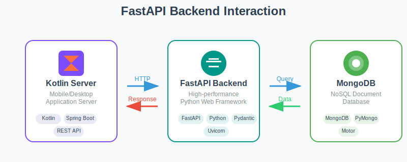

# AI Backend

Python backend (FastAPI) providing AI services that support the platform. Requires MongoDB for memory/sessions and a Google Gemini model.



## Contents
- [Prerequisites](#prerequisites)
- [Installation](#installation)
- [Environment Variables](#environment-variables)
- [Run](#run)
- [Features](#features)

## Prerequisites
- Python 3.12+
- Running MongoDB (reachable URI)
- Google AI Studio API Key for Gemini: https://aistudio.google.com/apikey

## Installation
```bash
cd backend_ai
python -m venv .venv && source .venv/bin/activate  # or conda/pyenv
pip install -r requirements.txt
```

## Environment Variables
Create `.env` in the `backend_ai` folder (see `.env_example`):
- `MONGO_URI` = MongoDB connection string (required)
- `BACKEND_CORE` = Core Backend host:port (e.g., `localhost:9000`)
- `GEMINI_MODEL_ID` = model id (default: `gemini-2.5-flash-lite`)
- Google AI key (choose based on client):
  - `GOOGLE_API_KEY` for integrations with `google-generativeai`
  - `GEMINI_API_KEY` for libraries that explicitly require it

## Run
```bash
fastapi run main.py
```
Or with alternative ASGI setups: https://fastapi.tiangolo.com/deployment/manually/#use-the-fastapi-run-command

## Features
- Face recognition for authentication
- Vehicle feedback classification/normalization
- Maintenance planning
- Multi-agent team (admin/manager) with MongoDB-backed memory
